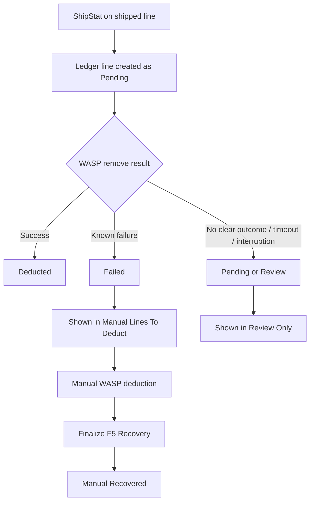

# F5 Outage Recovery Map

This is the current F5 operating model for ShipStation shipping and same-day outage recovery.

## Goal

When ShipStation orders are fulfilled during the morning print window, we need to know:

- what F5 already deducted in WASP
- what failed and still needs manual deduction
- what is ambiguous and must be reviewed first

## Truth Order

Use these sources in this order:

1. `F5 Shipment Ledger` hidden sheet
2. `Activity` tab
3. ShipStation shipment data
4. F5 cache state

If higher-level evidence exists, lower-level inference should not override it.

## Sheets And What They Mean

| Sheet / Source | Visible | Purpose | Trust Level |
| --- | --- | --- | --- |
| `F5 Shipment Ledger` | No | Line-level F5 shipment state: `Pending`, `Deducted`, `Failed`, `Manual Recovered` | Highest |
| `Activity` | Yes | User-friendly audit trail of F5 rows and child lines | High |
| `F5 Shipping` | Yes | Flow detail log for F5 | Medium |
| `F5 Recovery` | Yes | Temporary outage action sheet | Action sheet only |
| `F5 Recovery State` | No | Persistent record of shipments already manually recovered | High |
| ShipStation API | External | What shipped that day | High for shipment existence, not for WASP outcome |
| Cache `ss_shipped_<shipmentId>` | No | Shows F5 attempted processing | Low by itself |

## Visual Map

```text
ShipStation shipment created
        |
        v
F5 processShipment()
        |
        +--> write each shipment line to F5 Shipment Ledger as PENDING
        |
        +--> call WASP remove for each line/component
                |
                +--> success -> ledger line = DEDUCTED
                |
                +--> fail    -> ledger line = FAILED
        |
        +--> write Activity + F5 Shipping logs
        |
        v
Normal day complete


If outage / API problem happens during print window:

Build F5 Recovery Report
        |
        +--> read F5 Shipment Ledger first
        |       |
        |       +--> FAILED lines -> Manual Lines To Deduct
        |       +--> PENDING / unknown lines -> Review Only
        |       +--> DEDUCTED lines -> exclude
        |
        +--> if no ledger row exists, fall back to Activity / ShipStation
        |
        v
Manual WASP adjustment
        |
        v
Finalize F5 Recovery
        |
        +--> mark shipment as manually recovered
        +--> mark ledger lines as MANUAL RECOVERED
        +--> future F5/backfill skips that shipment
```

## Single-Line State Model



## Morning Print Window Workflow

### Normal

```text
Print / fulfill orders
-> F5 runs
-> WASP deductions succeed
-> ledger = Deducted
-> Activity shows Shipped / Deducted
-> no manual action
```

### If API breaks during the print window

```text
Print / fulfill orders
-> some F5 shipment lines fail or stay unresolved
-> Build F5 Recovery Report
-> use only "Manual Lines To Deduct" for manual WASP removals
-> do not use "Review Only" as direct action
-> after manual removals, run Finalize F5 Recovery
-> delete F5 Recovery tab if needed
```

## What Is Safe To Deduct Manually

Safe:

- ledger line status is `Failed`
- F5 `Activity` row is `Partial` or `Failed` and the child line itself is `Failed`
- shipment is not already marked `Manual Recovered`

Not safe without review:

- ledger line is `Pending`
- shipment has cache hit but no matching Activity row
- multiple ShipStation shipments for the same order
- shipment exists in ShipStation but there is no clear F5 result yet
- API timeout where success is uncertain

## What Each Recovery Section Means

### `Manual Totals`

Rollup of only the lines considered safe for manual deduction.

### `Manual Lines To Deduct`

This is the action list.

Every row here should mean:

- this individual item line still needs a WASP deduction
- it was not already confirmed as deducted
- it is not already marked as manually recovered

### `Review Only`

This is not an action list.

Rows here need a person to check before touching WASP.

## My Recommendation

Use this operating rule:

1. Treat the ledger as the main recovery truth.
2. Treat `Manual Lines To Deduct` as the only direct manual action list.
3. Treat `Review Only` as blocked until someone verifies the shipment.
4. Always run `Finalize F5 Recovery` after manual WASP changes.
5. Only delete the visible `F5 Recovery` tab after finalize.

## Current Limitation

This is much safer than reconstruction-only recovery, but it is still not mathematically perfect in one case:

- WASP may accept a deduction but the API response may fail before Apps Script receives confirmation.

In that case, the correct behavior is:

- do not auto-assume success
- do not auto-assume failure
- keep it in review unless there is confirming evidence

That is why `Review Only` still exists.
